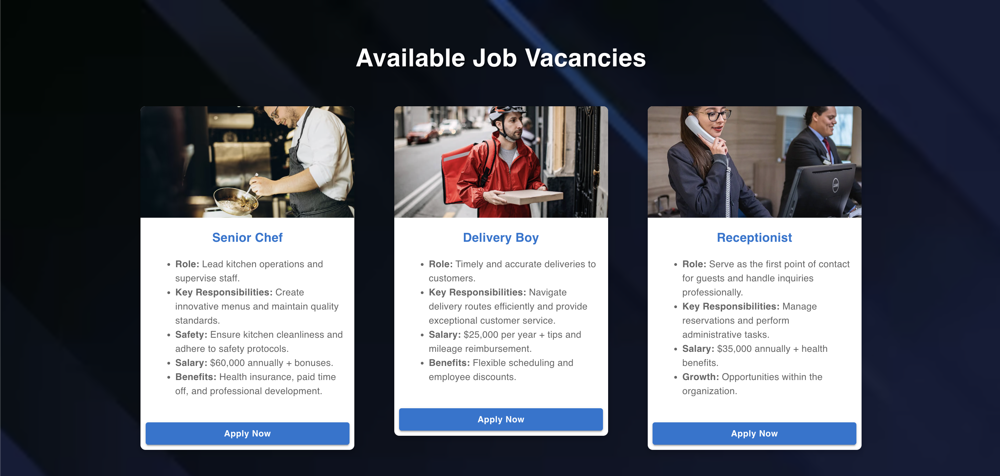

# PoojaIndians-Career Application Management System



A MERN stack web application that streamlines the job application process for users. This platform enables users to apply for job vacancies, manage their applications, track progress, and utilize various features designed for an efficient and user-friendly experience.

---

## 🌟 Key Features

- **Full CRUD Functionality**: Seamlessly create, read, update, and delete job applications.
- **Search Bar**: Easily search for specific job positions users have applied for.
- **Download Reports**: Generate and download comprehensive reports of job applications.
- **Progress Tracking**: A unique progress bar feature allows users to visualize their application progress in real-time.

---

## 🛠️ Technologies Used

- **Frontend**: React.js with Material-UI for modern and responsive UI components.
- **Backend**: Node.js and Express.js for server-side logic.
- **Database**: MongoDB for storing and managing application data.

---

## 🚀 How to Run the Project

### Prerequisites
Ensure you have the following installed on your system:
- Node.js
- MongoDB
- Git

### Steps to Set Up the Project

1. **Clone the Repository**:
   ```bash
   git clone https://github.com/Dilusha-Ranasingha/MERN_career_application_management_system.git
2. **Navigate to the project directory.**:
    ```bash
    cd career-application-management
3. **Install dependencies:.**:
    ```bash
    npm install
4. **MongoDB Connection:.**:
    ```bash
    https://www.mongodb.com
5. **Start the Backend server:.**:
    ```bash
    nodemon server.js
6. **Start the Frontend:.**:
    ```bash
    npm start

## 🧰 Languages and Tools:

  

  


